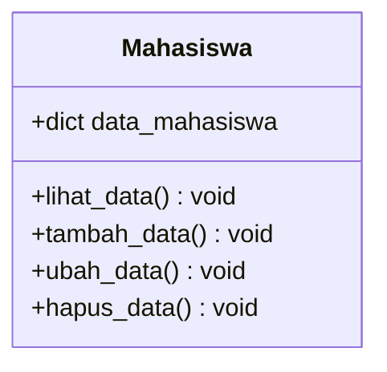

#
Nama : Sayidina Ramadhan
Nim : 312410112

## Diagram Class

## Flowchart
```mermaid
flowchart TD
    A([Start]) --> B[/User Input/]
    B -->|'T'| C[/Tambah Data/]
    B -->|'U'| D[/Ubah Data/]
    B -->|'H'| E[/Hapus Data/]
    B -->|'L'| F[/Lihat Data/]
    B -->|'K'| G([End])
    
    C --> H{Data Valid?}
    H -->|Yes| I[/Tambahkan ke data_mahasiswa/]
    H -->|No| J[/Tampilkan Pesan: Data Sudah Ada/]
    I --> B
    J --> B
   
    D --> K{Nama Ditemukan?}
    K -->|Yes| L[/Tampilkan Data Lama/]
    K -->|No| M[/Tampilkan 'Nama Tidak Ditemukan'/]
    L --> N[/Input Data Baru/]
    N --> O[/Perbarui Data dan Hitung Nilai Akhir/]
    O --> B
    M --> B
     E --> P{Data Kosong?}
    P -->|Yes| Q[/Kembali ke Menu/]
    P -->|No| R{Nama Ditemukan?}
    R -->|Yes| S[/Hapus Data/]
    R -->|No| T[/Tampilkan 'Nama Tidak Ditemukan'/]
    S --> B
    T --> B
    Q --> B
 F --> U{Ada Data?}
    U -->|Yes| V[/Tampilkan Tabel Data/]
    U -->|No| W[/Tampilkan 'Tidak Ada Data'/]
    V --> B
    W --> B
    
    G --> X([Selesai])
## input
```Python
class DaftarMahasiswa:
    def __init__(self):
        self.data_mahasiswa = []

    def tambah(self):
        """Menambah data mahasiswa baru."""
        nama = input("Masukkan nama mahasiswa: ")
        nilai = float(input("Masukkan nilai mahasiswa: "))
        self.data_mahasiswa.append({"nama": nama, "nilai": nilai})
        print("Data mahasiswa berhasil ditambahkan.")

    def tampilkan(self):
        """Menampilkan semua data mahasiswa."""
        if not self.data_mahasiswa:
            print("Data mahasiswa masih kosong.")
        else:
            print("Daftar Nilai Mahasiswa:")
            print("--------------------------")
            for mahasiswa in self.data_mahasiswa:
                print(f"Nama: {mahasiswa['nama']}, Nilai: {mahasiswa['nilai']}")
                print("--------------------------")

    def hapus(self, nama):
        """Menghapus data mahasiswa berdasarkan nama."""
        for i, mahasiswa in enumerate(self.data_mahasiswa):
            if mahasiswa['nama'].lower() == nama.lower():
                del self.data_mahasiswa[i]
                print(f"Data mahasiswa dengan nama {nama} berhasil dihapus.")
                return
        print(f"Data mahasiswa dengan nama {nama} tidak ditemukan.")

    def ubah(self, nama):
        """Mengubah data mahasiswa berdasarkan nama."""
        for mahasiswa in self.data_mahasiswa:
            if mahasiswa['nama'].lower() == nama.lower():
                nilai_baru = float(input("Masukkan nilai baru: "))
                mahasiswa['nilai'] = nilai_baru
                print(f"Data mahasiswa dengan nama {nama} berhasil diubah.")
                return
        print(f"Data mahasiswa dengan nama {nama} tidak ditemukan.")

# Inisialisasi objek DaftarMahasiswa
daftar_mahasiswa = DaftarMahasiswa()

# Menu program
while True:
    print("\nMenu:")
    print("1. Tambah data mahasiswa")
    print("2. Tampilkan data mahasiswa")
    print("3. Hapus data mahasiswa")
    print("4. Ubah data mahasiswa")
    print("5. Keluar")
    pilihan = input("Pilih menu (1/2/3/4/5): ")

    if pilihan == '1':
        daftar_mahasiswa.tambah()
    elif pilihan == '2':
        daftar_mahasiswa.tampilkan()
    elif pilihan == '3':
        nama = input("Masukkan nama mahasiswa yang ingin dihapus: ")
        daftar_mahasiswa.hapus(nama)
    elif pilihan == '4':
        nama = input("Masukkan nama mahasiswa yang ingin diubah: ")
        daftar_mahasiswa.ubah(nama)
    elif pilihan == '5':
        print("Terima kasih! Program selesai.")
        break
    else:
        print("Pilihan tidak valid.")class DaftarMahasiswa:
    def __init__(self):
        self.data_mahasiswa = []

    def tambah(self):
        """Menambah data mahasiswa baru."""
        nama = input("Masukkan nama mahasiswa: ")
        nilai = float(input("Masukkan nilai mahasiswa: "))
        self.data_mahasiswa.append({"nama": nama, "nilai": nilai})
        print("Data mahasiswa berhasil ditambahkan.")

    def tampilkan(self):
        """Menampilkan semua data mahasiswa."""
        if not self.data_mahasiswa:
            print("Data mahasiswa masih kosong.")
        else:
            print("Daftar Nilai Mahasiswa:")
            print("--------------------------")
            for mahasiswa in self.data_mahasiswa:
                print(f"Nama: {mahasiswa['nama']}, Nilai: {mahasiswa['nilai']}")
                print("--------------------------")

    def hapus(self, nama):
        """Menghapus data mahasiswa berdasarkan nama."""
        for i, mahasiswa in enumerate(self.data_mahasiswa):
            if mahasiswa['nama'].lower() == nama.lower():
                del self.data_mahasiswa[i]
                print(f"Data mahasiswa dengan nama {nama} berhasil dihapus.")
                return
        print(f"Data mahasiswa dengan nama {nama} tidak ditemukan.")

    def ubah(self, nama):
        """Mengubah data mahasiswa berdasarkan nama."""
        for mahasiswa in self.data_mahasiswa:
            if mahasiswa['nama'].lower() == nama.lower():
                nilai_baru = float(input("Masukkan nilai baru: "))
                mahasiswa['nilai'] = nilai_baru
                print(f"Data mahasiswa dengan nama {nama} berhasil diubah.")
                return
        print(f"Data mahasiswa dengan nama {nama} tidak ditemukan.")
# Inisialisasi objek DaftarMahasiswa
daftar_mahasiswa = DaftarMahasiswa()

# Menu program
while True:
    print("\nMenu:")
    print("1. Tambah data mahasiswa")
    print("2. Tampilkan data mahasiswa")
    print("3. Hapus data mahasiswa")
    print("4. Ubah data mahasiswa")
    print("5. Keluar")
    pilihan = input("Pilih menu (1/2/3/4/5): ")

    if pilihan == '1':
        daftar_mahasiswa.tambah()
    elif pilihan == '2':
        daftar_mahasiswa.tampilkan()
    elif pilihan == '3':
        nama = input("Masukkan nama mahasiswa yang ingin dihapus: ")
        daftar_mahasiswa.hapus(nama)
    elif pilihan == '4':
        nama = input("Masukkan nama mahasiswa yang ingin diubah: ")
        daftar_mahasiswa.ubah(nama)
    elif pilihan == '5':
        print("Terima kasih! Program selesai.")
        break
    else:
        print("Pilihan tidak valid.")
```
```Python
Menu:
1. Tambah data mahasiswa
2. Tampilkan data mahasiswa
3. Hapus data mahasiswa
4. Ubah data mahasiswa
5. Keluar
Pilih menu (1/2/3/4/5): 1
Masukkan nama mahasiswa: Sheila
Masukkan nilai mahasiswa: 89
Data mahasiswa berhasil ditambahkan.

Menu:
1. Tambah data mahasiswa
2. Tampilkan data mahasiswa
3. Hapus data mahasiswa
4. Ubah data mahasiswa
5. Keluar
Pilih menu (1/2/3/4/5): 2
Daftar Nilai Mahasiswa:
--------------------------
Nama: Sheila, Nilai: 89.0
--------------------------

Menu:
1. Tambah data mahasiswa
2. Tampilkan data mahasiswa
3. Hapus data mahasiswa
4. Ubah data mahasiswa
5. Keluar
Pilih menu (1/2/3/4/5): 5
Terima kasih! Program selesai.
```
